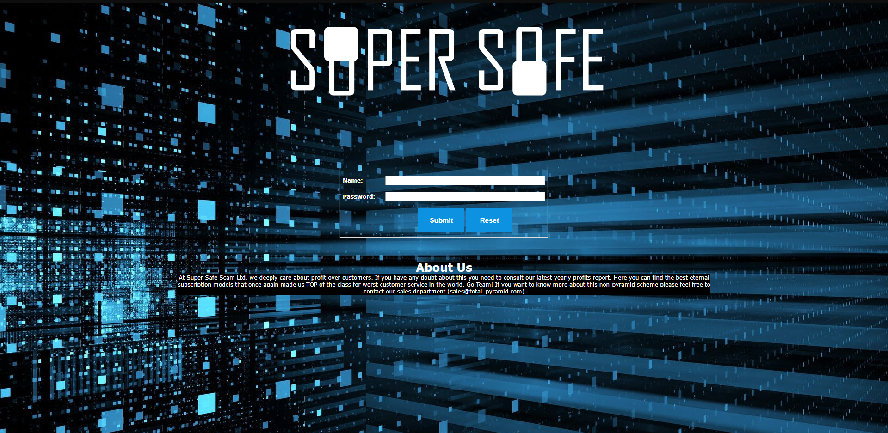

# Super Secure

### Description 

This is so unbreakable! http://ez.ctf.cafe:8888

### Hint 

Did you get your Covid Injection?

### Writeup

When you open the website, you will see something like this

Now, seeing this like of name and password, one thing will directly popup in your mind, what is it?

Yes, that is SQL Injection

When we write `'` in name and password, we can see something like this

.png>)

From this, we get to know what this is MySQL Database, and how to do the injection in this website.

My Payload:

name: `admin' or ''='`&#x20;

password: `YouAreHacked`

Boom 💥, we got the Flag!!! 🥳

### Flag 

`EZ-CTF{N0t_S0_S4f3_4ft3r_411}`
